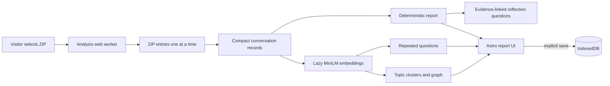

## Context

The owner supplied a real export with eleven `conversations-*.json` files,
individual chunks up to roughly 30 MB, a 128 MB rendered HTML file, and many
binary attachments. Reading the entire archive or all JSON chunks
simultaneously would create avoidable memory pressure. The deployed product is
a static Astro site; all archive processing must happen in the visitor's
browser.

## Goals / Non-Goals

**Goals:**

- Produce useful deterministic insights from large split exports.
- Use embeddings to reveal semantically repeated questions and topic
  relationships.
- Keep expensive parsing and inference off the UI thread.
- Keep semantic work bounded and explain sampling when it occurs.
- Make every derived memory group traceable to representative source
  conversations.
- Work without WebGPU and degrade to deterministic insights if model loading
  fails.

**Non-Goals:**

- Generative summaries or chat over the archive.
- Attachment, image, voice, Codex, feedback, or shared-link analysis.
- Server uploads, accounts, cross-device synchronization, or collaborative
  memory.
- Exhaustively embedding every message in arbitrarily large exports.

## Decisions

### Static Astro shell with a dedicated analysis worker

Astro supplies the deployed document shell while a module web worker owns ZIP
parsing, normalization, statistics, embedding, clustering, and search. The UI
receives structured progress and result messages.

Running the same pipeline on the main thread was rejected because parsing
multi-megabyte JSON and ONNX inference would make progress feedback unreliable.

### Incremental ZIP entry processing

`@zip.js/zip.js` discovers only root or nested files matching
`conversations*.json`. Entries are sorted, read, parsed, normalized, and
released one at a time. The normalizer follows each conversation's active path
from `current_node` through parent links so abandoned branch messages are not
double-counted.

The rendered HTML and attachment files are ignored. A custom ZIP parser was
rejected because ZIP64, compression, filename, and corrupted-archive handling
are parser-sensitive and not worth reimplementing.

### Compact normalized data

The worker retains conversation id, title, timestamps, model slug, message
counts, and bounded user-question text. Assistant bodies and attachments are
not retained after statistics are computed. This keeps the analysis focused on
the visitor's recurring intent and reduces memory use.

### Progressive insight pipeline

Deterministic totals, time distributions, streaks, depth, model mix, lexical
repetition, and recurring terms are emitted first. Semantic analysis starts
afterward with visible model-download and inference progress. If it fails, the
deterministic report remains usable.

### Embedding-only semantic memory

The worker lazy-loads `Xenova/all-MiniLM-L6-v2` through
`@huggingface/transformers`, using mean pooling, normalized output, quantized
weights, browser cache, and WASM as the compatibility baseline. Pipelines are
reused during an analysis and disposed when the worker resets.

Conversation fingerprints combine the title with bounded first and recent user
questions. Question candidates favor interrogative or request-shaped prompts,
deduplicate normalized text, and use a documented cap. Sampling keeps recent,
repeated, and long-lived themes before filling remaining slots evenly across
time.

A generative model was rejected for v1 because it adds a much larger download,
less deterministic claims, and no capability required for grouping or search.

### Fact candidates and change history

The memory ledger extracts only visitor-authored, first-person declarative
statements using documented patterns such as “I use,” “I prefer,” “my … is,”
“remember that,” and “from now on.” Correction and refutation cues such as
“actually,” “I no longer,” “that is not true,” and explicit negation receive
additional weight.

Embeddings group statements about the same likely subject. Within each group,
chronology and negation/correction cues classify the latest candidate as
current, a changed earlier value as updated, and an explicitly rejected value
as refuted. The UI preserves every version and source. These are detected
memory candidates, not verified real-world facts.

Assistant-authored assertions are excluded so the ledger represents what the
visitor said about themselves rather than claims the model introduced.

### Transparent query-tone estimate

Basic sentiment uses a small local lexicon with negation and intensifier rules
over visitor queries. It reports aggregate positive, neutral/direct, and
negative wording plus trends. It does not label the visitor, diagnose mood, or
run over assistant text. An additional classifier model was rejected because
the requested estimate does not justify another download in v1.

An adjacent deterministic vocabulary assigns one dominant language signal per
query: curiosity, frustration, urgency, uncertainty, excitement, appreciation,
or neutral/direct. Priority rules make overlaps stable, and the interface
defines each cue. The names describe matched wording, not how the visitor felt.

### Evidence-linked reflection questions

The worker turns bounded, high-confidence report structures into questions:
the strongest repeated intent, the latest updated and refuted memories, an old
current-looking memory, the month with the highest qualified
frustration-wording rate, and a substantial topic with no recent source. Each
prompt includes its trigger and source references. It is deterministic and
interrogative so the visitor remains the authority on meaning and current
truth.

### Extensible deterministic lenses

The deterministic report includes a lens registry rather than a single
hard-coded insight. Each domain lens owns a label, explanation, and local
patterns; queries may match multiple lenses because health-and-math or
career-and-software questions are legitimately overlapping.

A conservative typo lens recognizes only a small disclosed misspelling map and
immediately duplicated words. A thread-change lens compares content-word
overlap between substantial adjacent prompts, ignores short follow-ups, and
only flags conversations with several high-rate changes. Both return source
conversations and use candidate language. Browser embeddings may replace or
augment individual lenses later, but the v1 results remain fast, inspectable,
and available before the model finishes.

### Deterministic grouping and graph

Exact normalized repeats form groups before inference. Semantic question groups
use cosine similarity plus a lexical-overlap guard and require at least two
members. Conversation fingerprints use deterministic k-means; each cluster is
labelled from distinctive terms and representative titles rather than generated
copy.

The graph contains topic clusters rather than thousands of conversations.
Edges represent centroid similarity, while node size represents conversation
count. A small deterministic force layout renders as SVG. The same data is
available as a keyboard-navigable list and table.

### Explicit derived-memory persistence

Nothing is stored by default. “Keep on this device” writes a versioned derived
snapshot to IndexedDB, including compact records needed for report restoration
and search. The original ZIP and attachment bytes are never stored. “Forget”
deletes the database. Version mismatches fail closed and ask for a fresh import.

## Risks / Trade-offs

- **Large archives can exceed browser memory** → read one JSON entry at a time,
  discard assistant bodies, cap semantic candidates, and surface sampling.
- **First semantic run downloads a model** → show byte progress, cache files,
  and keep deterministic insights available.
- **Semantic similarity can group unrelated questions** → combine cosine and
  lexical evidence, expose representative sources, and describe groups as
  suggestions rather than facts.
- **Fact detection can miss implicit context or mistake a correction** → limit
  extraction to visitor-authored explicit language, preserve sources and
  versions, and label every result as a candidate.
- **Sentiment can confuse frustration with subject matter** → call it query
  tone, aggregate it, disclose the lexical method, and avoid person-level
  claims.
- **Emotion vocabulary can overread a single word** → call the categories
  language signals, use one disclosed dominant cue, aggregate them, and make
  evidence-opening controls available.
- **Reflection prompts can sound like conclusions** → phrase every item as a
  question, state the triggering rule, cap the set, and link its sources.
- **Domain rules can overlap or miss specialist wording** → allow overlap,
  define every lens, show both query and conversation counts, and link
  representative evidence.
- **Typos and topic shifts are ambiguous** → use conservative thresholds, call
  them likely candidates, avoid a quality or derailment score, and expose the
  exact source.
- **English MiniLM is weaker for multilingual exports** → name the limitation
  and keep deterministic analysis language-agnostic where possible.
- **WebGPU support varies** → use WASM as the baseline; WebGPU optimization is
  deferred until measured.
- **A saved snapshot contains private derived text** → require explicit consent,
  keep it origin-local, and provide a prominent forget action.

## Migration Plan

This is a new static product with no users or stored data to migrate. Deploy the
built `dist/` directory to one Cloudflare Pages project. Rollback is a Pages
deployment rollback. Schema changes to saved snapshots increment the local
version and require re-import rather than attempting lossy migration.

## Open Questions

- A multilingual embedding model may replace the English model if real usage
  shows sufficient demand and its browser cost remains acceptable.
- Exported memories outside `conversations*.json` may become a separate,
  explicitly scoped capability after their current schema is validated.
