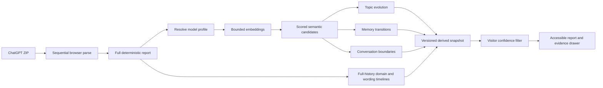

## Context

Memory Map currently parses the export once, emits deterministic insights, then
loads one pinned English MiniLM model to build semantic repeats, fact groups, a
topic graph, and a search index. The completed report stores only derived data.
The next phase must add richer longitudinal and intra-conversation analysis
without retaining the ZIP, introducing a server, or making a second model
mandatory.

The supplied export is large enough that unbounded pairwise prompt embedding is
not viable. The UI is already a dense single-page operational workbench with a
tracked Memory Transit Atlas design system, so this change expands that system
in preserve mode.

## Goals / Non-Goals

**Goals:**

- Preserve chronological evidence for memory changes and possible
  contradictions.
- Replace rough thread counts with inspectable, bounded conversation strands.
- Show meaningful change over time across topics, domains, and wording.
- Support multilingual semantic similarity with an explicit browser cost.
- Let visitors refilter uncertain findings without re-reading the archive.
- Keep the deterministic report useful if model loading fails.

**Non-Goals:**

- Generative summaries, causal explanations, personality conclusions, or
  medical interpretation.
- Automatic translation, language identification across every Latin-script
  language, attachment analysis, cross-device sync, or server storage.
- Embedding every prompt in very large exports.

## Decisions

### Store evidence scores and filter after analysis

Semantic repeat groups, memory transitions, reflection questions, and thread
boundaries will carry normalized confidence scores. The worker computes
candidates down to an exploratory floor; the UI applies the visitor's active
threshold.

This allows instant post-analysis tuning and preserves one stable semantic
index. Re-running the model for every slider change was rejected because it
would be slow, wasteful, and impossible after restoring a snapshot without the
source ZIP.

### Use three confidence presets over one shared numeric policy

The UI exposes exploratory, balanced, and conservative presets plus the numeric
threshold they represent. A shared `confidenceThreshold()` helper maps the
0–100 value into per-signal cutoffs; each signal still displays its raw score
and method.

Per-feature advanced settings were rejected for this phase because they would
turn the report into a calibration console before real usage shows that level
of control is valuable.

### Keep the compact model and add a selectable multilingual model

The compact profile remains
`Xenova/all-MiniLM-L6-v2@751bff37182d3f1213fa05d7196b954e230abad9`.
The multilingual profile uses
`Xenova/paraphrase-multilingual-MiniLM-L12-v2@2c4055b12046f11709e9df2c122e59ffbdc2f900`
with q8 weights. Both run through the existing Transformers.js feature
extraction pipeline and browser cache.

Automatic mode samples parsed prompt characters. A material supported
non-Latin-script share resolves to multilingual; otherwise it resolves to
compact and explains the limitation for non-English Latin-script histories.
Making the roughly 135 MB multilingual download universal was rejected because
most English-only visitors would pay a substantial cost without benefit.

### Key extractors by resolved model

The semantic module will cache at most one extractor. Switching profiles
disposes the previous pipeline before loading another, and restored search uses
the snapshot's exact model metadata. This prevents mixing embedding spaces and
keeps browser memory bounded.

### Shortlist threads lexically, refine boundaries semantically

The deterministic pass keeps its conservative likely-thread shortlist. The
semantic pass then selects the strongest candidates, caps ordered prompts,
embeds them once, and scores adjacent substantial prompts with a blend of
cosine similarity and lexical overlap. Short follow-ups inherit their
surrounding strand.

Embedding every prompt from every conversation was rejected because it would
materially increase time and memory. Pure lexical segmentation was rejected
because related prompts with different wording would split too often.

### Derive longitudinal signals from existing evidence

Topic evolution comes from sampled conversation-to-topic assignments aggregated
by month. Domain and language-signal evolution come from full deterministic
prompt counts. Memory evolution comes from fact histories. Trend labels require
minimum evidence and compare normalized shares, not raw volume alone.

This avoids a new model and reduces activity-volume bias. The report always
shows the underlying period counts so emerging, fading, and resurfacing remain
inspectable heuristics.

### Extend the transit-atlas workbench in preserve mode

The existing graph remains the focal map. A compact “analysis lens” control
appears near methodology and remains available in the report. A new
“How your map changed” section uses a route timeline with selectable topic and
domain rows. Thread candidates expand into sequential strand lines, and fact
evidence becomes a chronological station chain in the existing evidence
drawer.

The interface will not become a grid of generic analytics cards, and core
navigation labels, import flow, search, graph, and privacy copy remain intact.

## Data Flow

## Risks / Trade-offs

- **Larger multilingual download** → Keep it optional/automatic, disclose the
  approximate size before loading, cache it in the browser, and never load both
  models at once.
- **Confidence scores may look more scientific than they are** → Call them
  evidence confidence, show methods and sources, use qualified copy, and avoid
  decimal precision beyond a percentage.
- **Possible contradictions can be false positives** → Require multiple
  distinct statements, keep them separate from explicit refutations, and
  default to the balanced threshold.
- **Thread sampling can miss a boundary in very long conversations** → Preserve
  prompt order, report analyzed versus total prompts, and retain the
  deterministic candidate as fallback.
- **Snapshot schema changes** → Bump the snapshot version and continue the
  existing fail-closed behavior rather than silently migrating incompatible
  embedding metadata.
- **More report sections can reduce scanability** → Preserve the fixed route
  index, add one new evolution stop, use compact rows, and move detail into the
  evidence drawer.

## Migration Plan

1. Add types and pure deterministic/semantic helpers with unit tests.
2. Bump the snapshot schema and reject earlier saved snapshots with a clear
   re-import message.
3. Add import and report controls, longitudinal views, strand rendering, and
   fact timeline evidence.
4. Validate on synthetic multilingual and contradiction fixtures plus the
   owner-supplied export.
5. Archive the OpenSpec change, update product/design/status docs, commit, push,
   pass the Fleet deploy guard, and deploy the existing Pages project.

Rollback is the previous immutable Pages deployment and Git commit. No source
data or remote database migration is involved.

## Open Questions

None blocking. Real usage should determine whether future versions need
per-signal confidence controls, automatic Latin-script language identification,
or a smaller multilingual model.
