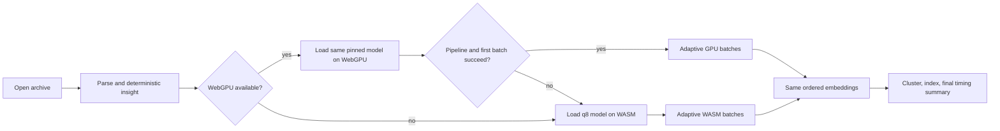

## Context

The real owner archive produces 3,573 semantic inputs: 600 conversation
fingerprints, 800 question prompts, 1,376 fact candidates, 20 topic anchors,
and 777 thread prompts. The current portable q8/WASM pipeline processes them
in batches of 24 and took about 188 seconds end to end with a warm cached model.
Deterministic analysis became usable in about two seconds.

Transformers.js 3.8.1 supports feature extraction through WebGPU by selecting
`device: "webgpu"` and retains WASM as the portable browser fallback. Hardware,
driver, browser, model-download, and cache conditions vary, so the product must
measure the actual run rather than promise a fixed duration.

## Goals / Non-Goals

**Goals:**

- Preserve every deterministic result and the exact existing bounded semantic
  candidate set.
- Make the first usable insight, current work, elapsed time, and remaining time
  legible throughout analysis.
- Include model loading/downloading in an end-to-end total.
- Prefer accelerated inference when supported and recover automatically to the
  current portable path.
- Measure the owner archive before and after on the same browser and cache
  conditions.

**Non-Goals:**

- Removing existing candidate classes or lowering their caps.
- Changing embedding models, revisions, similarity thresholds, or result
  semantics for speed.
- Promising the same multiplier on every device or network.
- Moving private text to a server.

## Decisions

### 1. Instrument the worker as the timing authority

The analysis worker will own a monotonic timer and stage ledger because archive
parsing, model preparation, inference, and clustering all happen there. Each
progress message will include:

- stable stage id and human label;
- current and total units;
- current-stage elapsed milliseconds;
- total elapsed milliseconds;
- estimated remaining milliseconds when enough progress exists;
- selected runtime and batch size when known.

The completed report stores a compact performance summary so the final total
survives report rendering and optional device-local persistence.

### 2. Use throughput-derived estimates, not a fictional fixed schedule

For byte and candidate progress, remaining time is calculated from observed
units per millisecond after a minimum useful sample. The estimate is smoothed
to avoid second-by-second oscillation and displayed as a range until the stage
stabilizes. Unknown work says “estimating…” rather than inventing a number.

Completed stages retain their measured durations in a route ledger. The
deterministic report marks the first-insight time while semantic work continues.

### 3. Prefer WebGPU with a same-model WASM fallback

The runtime selection does not alter sampling, model id, revision, pooling,
normalization, or output ordering. GPU initialization or first-inference
failure disposes that extractor and retries the full ordered input list through
WASM.

### 4. Batch for the device while bounding memory

The GPU path starts with a larger batch than the current 24; the WASM path uses
a more conservative increase. Both are constants with tests and can fall back
to smaller batches after an out-of-memory or allocation error. Batching changes
execution packing only; each returned vector is sliced back into the original
input order.

### 5. Separate “usable” from “complete”

The report remains visible as soon as deterministic analysis finishes. A
compact timing board in the report header communicates:

- initial insights ready in N seconds;
- semantic stage, runtime, and progress;
- elapsed and estimated remaining time;
- final “Complete in N” total after clustering and render data arrive.

The dedicated pre-report progress screen shows the same stage route during ZIP
discovery and parsing.

## Risks / Trade-offs

- **[WebGPU is unavailable or unstable]** → Detect support, catch pipeline and
  first-batch failure, dispose, and retry through WASM without dropping inputs.
- **[GPU fp32 increases first-download size]** → Benchmark first and warm runs,
  keep multilingual histories on the smaller q8 compatibility path, and
  disclose actual model time separately.
- **[Large batches exhaust memory]** → Use bounded device defaults and halve the
  batch after recognized allocation failures.
- **[ETA fluctuates]** → Delay the estimate, smooth throughput, round durations,
  and prefer a range over false precision.
- **[Saved reports imply current-device speed]** → Label stored timings as the
  original analysis run, not a prediction for future imports.

## Migration Plan

The new performance metadata is optional so existing in-memory and saved
version-3 reports remain readable. No data migration is required. Reverting the
change removes the timing board and returns inference to the current WASM
pipeline without changing archive or snapshot data.

## Open Questions

- Whether a future quantized WebGPU route can outperform the measured fp32
  path without reducing candidate coverage or increasing browser memory.
