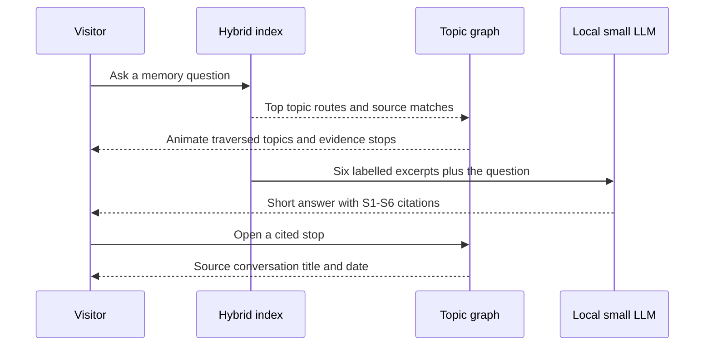

## Context

The semantic worker already holds a bounded hybrid index with embeddings,
lexical entries, topic assignments, and source references. The graph renders
the topic topology, but search currently opens a separate result list and does
not expose its route through that topology. The new experience must add local
generation without recreating the multi-tab model accumulation that caused the
benchmark incident.

The selected generator is pinned
`Xenova/LaMini-Flan-T5-77M@ac7ed8d…`, using its approximately
105 MB q8 compatibility artifacts. It is intentionally small and
English-focused; retrieval quality and citations matter more than unsupported
general reasoning.

## Goals / Non-Goals

**Goals:**

- Make query retrieval visible on the semantic graph before generation.
- Give the local model only six bounded, labelled evidence excerpts.
- Require citations and preserve a direct route to every cited source.
- Keep a short conversational thread without silently rewriting memory.
- Make model consent, progress, runtime, limitations, and unloading explicit.
- Enforce one analysis/model-owning tab and release workers on reset or unload.

**Non-Goals:**

- Sending text to a hosted LLM or application API.
- Giving the generator the full export or raw attachments.
- Treating generated prose as a new fact, correction, or graph edge.
- General-purpose assistant quality, medical advice, or reliable arithmetic.
- Claiming knowledge of current ChatGPT retrieval internals.

## Decisions

### 1. Retrieval remains authoritative; generation is a cited presentation layer

The generator cannot add search results. If evidence is weak, its system prompt
requires an insufficiency statement. Deterministic evidence remains visible
even if model loading or generation fails.

### 2. Add compact answer context to search entries

Every index entry gains an optional bounded `context` string:

- conversation: title plus first and most recent sampled user prompts;
- question and fact: the visitor-authored text;
- topic: label, count, and distinctive terms;
- strand: the bounded prompts already used to form that strand.

Results without a direct topic inherit the topic assigned to their source
conversation. This lets every retrieved result explain its graph route without
changing ranking.

### 3. Use a dedicated opt-in generation worker

The chat worker loads only after the visitor activates Memory Chat. A separate
worker keeps generation failure isolated from the searchable analysis worker
and can be terminated immediately by “Unload model,” reset, or page exit.
Generation is capped at 96 new tokens and receives at most six evidence items
plus four recent chat turns.

The analysis worker and chat worker may coexist only after analysis is
complete. Cross-tab Web Locks prevent another tab from starting a second
analysis/model owner. A blocked tab does not parse the archive or load weights.

### 4. Treat traversal as temporary query state

The report graph remains the durable memory topology. A question adds a
temporary query interchange and animated paths to at most four matched topic
nodes. Traversed nodes and edges use a labelled state, not color alone.
Reduced-motion mode displays the completed route immediately.

### 5. Compare product behavior, not model intelligence

The panel explains this prototype through visible properties: bounded
retrieval, citations, explicit changed/refuted states, local execution, and an
inspectable route. Any legacy comparison links to OpenAI’s own Memory FAQ,
which describes stale and contradictory behavior in the previous saved-memory
experience. The copy does not imply that the 77M model is more capable than
ChatGPT or describe current internal architecture.

## Risks / Trade-offs

- **[Small model invents or drops citations]** → Keep the evidence pack visible,
  require bracket citations, label prose as local synthesis, and never promote
  it into memory state.
- **[105 MB download surprises the visitor]** → Require explicit activation and
  show model id, approximate size, progress, cache behavior, and unload control.
- **[GPU memory remains high after chat]** → Terminate the dedicated worker on
  unload/reset/pagehide; retain no model singleton in the main thread.
- **[A result has no topic]** → Inherit the source conversation topic; show an
  “evidence-only” stop when no sampled conversation assignment exists.
- **[Graph animation overwhelms]** → Cap routes, stagger once, and provide a
  text traversal ledger with reduced-motion parity.
- **[77M English quality is limited]** → Keep answers short and assistive,
  expose evidence first, and say when the model is unsuitable.

## Migration Plan

Search `context` and `topicId` remain optional, so version-3 snapshots still
restore. Older results show an evidence-only route. Removing the chat panel and
worker leaves the semantic graph and search behavior unchanged.

## Open Questions

- A larger 360M model may improve synthesis but is deferred until an explicit
  memory and latency budget is measured on representative devices.
