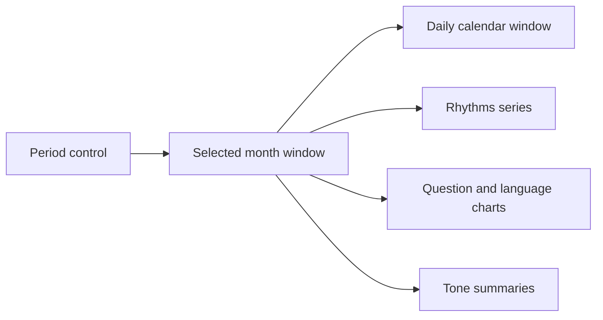

## Context

The global period control already rerenders the report, but the calendar caps
itself at 52 weeks and the old Rhythms bars ignore the selected period. The
result is especially misleading when moving from 12 months to 24 months or all
history. The topic-momentum chart also places labels inside a narrow
half-width plot, so long topic names collide at the emerging edge.

The completed report currently renders three large operational surfaces before
the durable insights: timing, search, and analysis controls. Timing and model
selection are valuable evidence, but they are review-once information after
completion. Search is durable, but it belongs with the semantic map it queries.

## Goals / Non-Goals

**Goals:**

- Make every period option cause a truthful, visible calendar and rhythm
  update.
- Show conversation scale and approximate word volume without recomputing the
  archive.
- Reuse the disclosed question-domain vocabulary for filtering.
- Preserve source alternatives, keyboard access, old version-3 snapshots, and
  the transit-atlas visual system.
- Let the durable report begin with insights instead of operational receipts.

**Non-Goals:**

- Inferring mutually exclusive conversation categories.
- Reclassifying semantic topics during period changes.
- Adding server persistence, analytics, or a new chart dependency.
- Removing timing, model, confidence, search, or source evidence.

## Decisions

### 1. Store one bounded monthly rhythm aggregate

The deterministic report receives optional activity rhythm series for all
conversations and each disclosed question route. Every month stores
conversation count, message count, visitor-prompt count, and approximate words
for matched conversations.

Domain routes overlap by design. The UI states that route-filtered word totals
cover complete matched conversations and are not parts of a whole. Old saved
version-3 reports without this optional field fall back to the existing monthly
conversation counts.

### 2. Use one period source of truth

The calendar derives its start and end from the selected months rather than a
fixed 52-week cap. Long windows use a fixed-size inner calendar inside a
horizontal scroller and initially reveal the most recent weeks. The page itself
never overflows horizontally.

### 3. Make Rhythms a real chart

Observable Plot is already a production dependency used throughout the atlas.
Rhythms uses it for one filled line series with:

- a measure switch: conversations or approximate words;
- a route filter: all conversations or one disclosed domain;
- selected-period totals and peak month;
- an accessible readable-data disclosure.

The chart rerenders from stored monthly aggregates only. It never reloads a
model or rereads the ZIP.

### 4. Prioritize durable content after completion

Timing and analysis controls move into one native `details` disclosure.
Deterministic/semantic work keeps it open while running; a complete or restored
report closes it by default. The single search form moves into the topic-map
workbench before the graph.

The route rail keeps its established labels and order, but gains a clearer
transit line, hover/focus grouping, and `aria-current="location"` from a bounded
IntersectionObserver.

### 5. Give evidence its own reading surface

The evidence drawer widens modestly on desktop, increases header and body
spacing, groups explanatory notes, numbers source rows, and adds a restrained
backdrop. Mobile remains full-width. Existing focus trapping, Escape handling,
and focus restoration remain unchanged.

### 6. Keep plot labels inside their lane

Topic momentum reserves a wider right margin, truncates fewer labels more
aggressively, and anchors emerging-edge labels inward. Full labels remain in
SVG titles, accessible names, and the readable-data disclosure.

## Risks / Trade-offs

- **[All-history daily calendar becomes too wide]** → Keep cells fixed and
  scroll only inside the calendar, defaulting to the latest edge.
- **[Domain word totals appear additive]** → State that routes overlap and
  count complete matched conversations.
- **[Analysis controls become undiscoverable]** → Use a persistent summary that
  names the current confidence and total execution time.
- **[Old snapshots lack new rhythm data]** → Treat the aggregate as optional and
  fall back to all-conversation monthly counts.
- **[Scroll-spy flickers]** → Observe only report section anchors and choose the
  highest intersecting section with a stable root margin.

## Migration Plan

The added deterministic field is optional and serializable. Version-3
snapshots continue to restore. Re-importing the original ZIP adds word and
route filtering. The change can be removed without a data migration.
