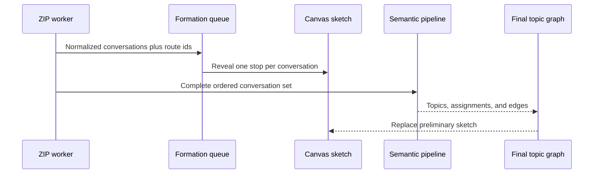

## Context

The worker normalizes conversations chunk by chunk, then builds deterministic
insights, then performs bounded embedding and clustering. Topic assignments do
not exist during parsing, so repeatedly reclustering partial embeddings would
be slower, unstable, and misleading.

The existing deterministic question-domain lenses already provide a
transparent route vocabulary. They can attribute each parsed conversation to
zero or more disclosed domains without model work. The formation view therefore
uses those routes as an explicitly preliminary sketch and reserves semantic
topic claims for the completed graph.

## Goals / Non-Goals

**Goals:**

- Make every parsed conversation visibly contribute one distinct graph stop.
- Start the visual transformation during ingestion rather than after analysis.
- Keep the preview method legible and distinct from semantic clustering.
- Preserve current analysis coverage, ordering, memory use, and completion time.
- Support large archives, reduced motion, reset, cancellation, and restoration.

**Non-Goals:**

- Incremental semantic clustering after every conversation.
- Claiming that deterministic question lenses are final topics.
- Delaying the completed report until an animation finishes.
- Persisting animation state or adding a charting or motion dependency.
- Drawing assistant messages, attachments, or every prompt as separate nodes.

## Decisions

### 1. Emit normalized conversation batches

The worker posts one formation message per parsed JSON chunk. Each entry
contains only the conversation id, title, date, and deterministic route ids.
This avoids thousands of cross-thread messages while retaining one visual stop
per conversation in the main-thread queue.

### 2. Reuse disclosed question-domain rules

The existing question-lens patterns become a small exported classifier.
Conversation route ids are the union of matches across visitor prompts. An
unmatched conversation uses an explicit `other` hub; it is never discarded.

The UI labels the canvas “ingestion sketch” and explains that the embedding
model will replace it with the final semantic topology.

### 3. Draw with one bounded canvas

A canvas avoids creating thousands of focusable or layout-driving DOM nodes.
Route hubs use the existing transit colors and fixed positions. Every
conversation receives a stable hash-based position near its primary hub and a
thin connection to up to three matching hubs.

The queue processes entries in order. It may add several entries during one
animation frame so large histories finish within a bounded visual window, but
each entry still gets its own point and edges. Rendering never blocks worker
analysis.

### 4. Preserve continuity between progress and report

The same formation element begins inside the progress view. When deterministic
insights become available, the app moves that element into the topic-map
loading region without resetting its canvas or queue. The final SVG graph then
crossfades in when semantic analysis completes.

### 5. Treat motion as explanation, not latency

The focal motion is the accumulation of conversation stops around route
interchanges. Counts and the latest title provide textual continuity. No other
section receives a new entrance animation.

Reduced-motion mode adds received batches immediately and omits the crossfade.
Cancellation and reset stop the animation frame, clear titles and counts, and
return the formation element to its initial progress slot. Restored snapshots
skip formation and render the saved final semantic graph directly.

## Risks / Trade-offs

- **[Preview is mistaken for semantic truth]** → Name it an ingestion sketch,
  show its deterministic domain method, and visibly hand off to the final
  embedding graph.
- **[Large archive overwhelms rendering]** → Use one canvas, chunked worker
  messages, capped edges per conversation, and adaptive entries per frame.
- **[Animation outlives analysis]** → Never delay completion; flush pending
  counts and let the final graph replace the sketch immediately.
- **[Conversation title announcements become noisy]** → Keep the global
  progress live region authoritative and treat the latest-title ticker as
  visible, non-live supporting text.
- **[Canvas is inaccessible]** → Provide count, stage, method, and current-title
  text during formation; the completed graph retains its full accessible list.

## Migration Plan

The new worker response is transient and optional. Saved version-3 snapshots
remain unchanged and restore directly into the completed semantic graph. The
feature can be removed without data migration.
